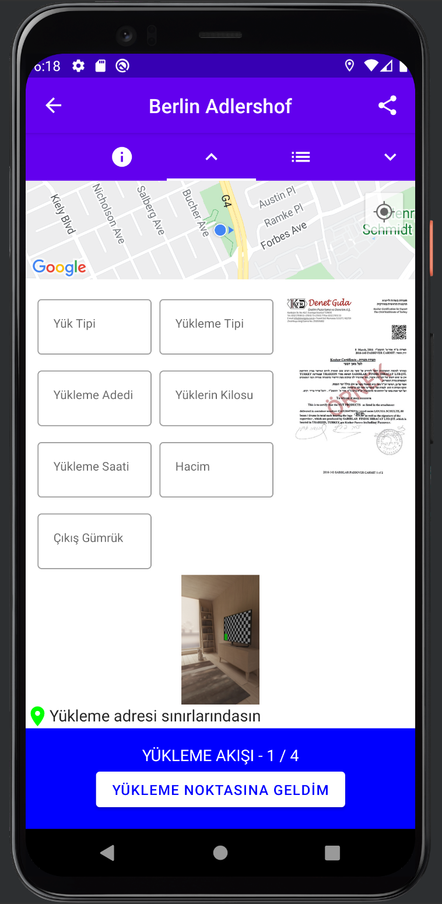

# Xoii Demo Project

Demo project for demonstrate simple usage of jetpack libraries.

- Run the project
- Give location permission

## Features

- Shows current location on the map
- Multiple tab support
- Zoomable ImageViewer (Click on document image to open)
- Image picker (Pick Images from Camera or Gallery)

## Tech

Application uses the following libraries and etc. :

- [Jetpack Compose] - Library for Drawing UI
- [Accompanist Pager] - Library for tabs and tab pages
- [Compose Navigation] - Library for implementing navigation to compose.
- [Maps Compose] - Library for showing maps on compose screen
- [Play Services Maps] - Library for getting location services
- [Dexter] - Library for handling runtime permissions
- [TedImagePicker] - Library for getting images from device

## Installation

Download the code and run.

## 📱 Screenshots

  

